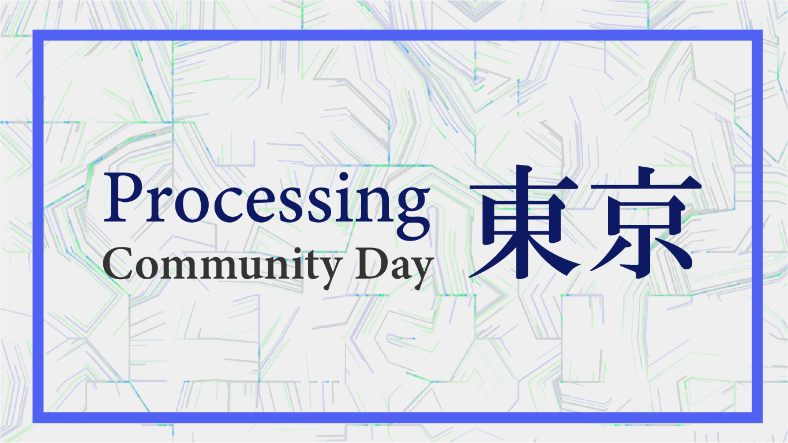

# 1. Processing Community Day Tokyo 2019について

今回、東京ではじめての開催となるProcessing Community Day Tokyo 2019が、2019年2月2日（土）、[Yahoo! LODGE](https://lodge.yahoo.co.jp/) にて開催します！

Processing を作品制作に活用しているアーティストや研究者の基調講演、公募によるライトニングトーク（一人5分程度のプレゼンテーション）、少人数集中型のワークショップ、ワールドカフェ（オープンディスカッション）を行います。

ワークショップは初心者向けのものから、インタラクティブ／グラフィック／デザイン／機械学習といった様々なテーマに特化したものなど幅広く用意します。ワークショップは少人数に分かれての集中型としてデザインされ、講師と対話しながら学ぶことができます。初心者や独学者のみなさんも奮ってご参加ください。講演登壇者やワークショップ講師、スケジュール等は、本番に向けて順次公開していきます。

# 1.1. ご支援のお願い

Processing Community Day Tokyoは現在、100%ボランティアによって成り立っています。チケット代は講師や講演者の謝礼にあてるという最小限の運営構成をとっています。そのため、講師謝礼以外の実費（Webや紙面の作業負担や諸経費）は個人の持ち出しで行われています。

イベント運営にかかる最低限の費用（ボランティアの方の交通費や印刷物、ワークショップなどにかかる諸経費）をあがない、より健全で柔軟性のある運営を行うために最低限のご援助をお願いするために、本ファンディングを立ち上げました。
2/2のProcessing Community Day Tokyoをより良い1日にするために、みなさまのお力をお借りしたいです！

* イベントは本ファンディングは達未達に関わらず、実施されます。
* 利益を出すことを一切目的とせず、実負担より超過した分はすべてProcessing Foundationに寄付いたします。
* 運営費用についてはすべて事後公開されます。

# 1.1. Processing Community Day Tokyo クラウドファンディング発起人

◯永松歩
https://ayumu-nagamatsu.com/
東京を拠点とするフリーランスのプログラマー、リサーチャー。ジェネラティブ・デザインやデータ可視化の様式に着目しCGやインスタレーションなどを制作する。

◯稗田直人
http://naotohieda.com/
日本とカナダを拠点に、メディアアートやコンテンポラリーダンスの分野で活動中のアーティスト。

# 1.2. Processingについて

Processingは、マサチューセッツ工科大学メディアラボ（MIT Media Lab）発祥の教育用プログラミング言語です。現在はProcessing Foundationが運営しており、無料、オープンソースのプロジェクトです。誰でも無料でダウンロードして利用することができます。

Processing 公式ウェブページ
https://processing.org/

シンプルな記法による簡単な言語インターフェースが特徴で、プログラミングにあまり馴染みがない人でも比較的手を付けやすく、表現に結びつけやすいことから、プログラミングの入門だけでなく、メディア・アートや科学研究など幅広い分野で用いられています。

日本においても、美大など情報と芸術が交わる教育の現場や、プロトタイピングの道具として広く利用されています。最近の美大で情報系に近い方々や、領域横断系の学部で学んだ方々は、使ったことがある、という方も少なくないと思います。

image by 永松歩

Processingは、そうしたプログラミングを活かした表現への入口になっているために、プログラミングによってデザインを自律的に生成していくGenerative Artや、プログラミングを創造的な行為と考えるCreative Codingという考えが普及した背景のひとつにもなっています。

Processing Foundationは、視覚表現にまつわるソフトウェアや、テクノロジーにまつわる視覚表現のリテラシーを啓発し、多様性を持ったコミュニティに参加できる場所をつくることをミッションとしており、人々のあらゆる興味や、プログラミングのやり方を学ぶことを支え、プログラミングを用いたクリエイティブな作品をつくること、特にこうしたツールやリソースにアクセスできなかったかもしれない人々をそうした環境に導くことをゴールとした組織です。Processing Community Dayもそうした思想に基づいて運営されています。

## 1.3. Processing Community Dayについて

Processing Community Day（PCD）は、Processingのユーザーの交流イベントです。アートとプログラミングのコミュニティの多様性を祝って、2019年1月15日から2月15日の間に、世界100ヶ所以上で開催されます。

Processingのパイオニアや若手アーティストらによる講演やワークショップを通じて、デモを体験したり、実際にスケッチを書いて動かしてみたり、Processingを通じて様々なバックグラウンドの方同士で交流をすることができます。

(https://day.processing.org/ より)

Processingは10年以上の歴史がありますが、公式のイベントとしては、2017年のボストンでの Processing Community Day が初めてです。そして今回、世界各地で改めてコミュニティの活性化をする目的で、ワールドワイドでイベントが行われます。

東京にもProcessingユーザーは数多くいますが、学校や既存のコミュニティ、アートやデザインやエンジニアリングといった専門領域の輪を超えて、様々な情報交換や交流ができる機会にしたいと考えています。また現在第一線で活躍しているアーティスト／デザイナー／クリエイターの方々はもちろん、若手のアーティストや学生、プログラミングを始めたばかりの方も参加できる、多様性のあるイベントにしたいと考えています。

# 2. 資金の使い道

Processing Community Day実施に際しての費用として、主に講師の方への謝礼金／交通費が30万円ほどかかることを見込んでおり、その分はチケットの売り上げでカバーする予定です。

しかし、イベントに際して、Webやハンドアウトなどの制作費用、ワークショップなどで発生する備品経費、ボランティアの交通費などのサポートに充てるため、有志の方々からのご支援を募りたく、CAMPFIRE手数料も見込んで、250,000円を目標金額にしたいと思います。

なお、最終的な収支はイベント終了後に、こちらのページ、ウェブサイト、Githubに掲載する予定です。

# 3. リターンについて
一般・企業のみなさま双方を想定して、p5スケッチ購入のリターンを用意しました。

## 3.3. 作品購入リターン枠

image by 稗田直人

オーガナイザーや講師のGenerative Artの、静止画データやプリントをご購入頂けます！作家は順次追加いたします。各画像各フォーマット限定5枚で、エディション番号と作者のサインを記載いたします（画像データの場合は番号と合わせてメールでお送りします）。稗田のプリントはプリントや額装の制作費を除き全額イベント開催費や寄付に充てられます。

◯4K静止画データコース(7,000円)
「レポート、講演資料をご共有しますコース(5,000円)」の内容に加え、4Kサイズ(3840×2160)のGenerative Art画像データを差し上げます。

◯A3プリントコース(10,000円)
「レポート、講演資料をご共有しますコース(5,000円)」の内容に加え、A3サイズ(297mmx420mm)のプリントを差し上げます。

◯A3額装コース(20,000円)
「レポート、講演資料をご共有しますコース(5,000円)」の内容に加え、A3サイズ(297mmx420mm)のプリントを額装したものを差し上げます。

◯大判プリントコース(50,000円)
「レポート、講演資料をご共有しますコース(5,000円)」の内容に加え、A1サイズ(594mmx841mm)のプリントを差し上げます。

## 4. 最後に
企画チームの永松歩が、今回の開催に際してブログを更新しています。その中から一部を引用します。

Processing Community Day Tokyo をやります | 永松 歩 | Ayumu Nagamatsu
https://ayumu-nagamatsu.com/archives/855/

-----------------

>コミュニティ（オープンソース・コミュニティとか）とはなにかを語ることはかなり難しいし、それはただのセクションを生んでしまうかねないので早々に考えるのをやめた。そのかわり、どういった人たちがどういう思いでツールからモチベーションを交換し創造的になったのかということが、お祝いの場のように楽しみながら共有できる場作りが重要であると認識している。結果的におそらくオンラインでは見知っていた同士が実地でつながるというようなことが必然的に起こると思う。

>一方で書籍やインターネット上で素晴らしい作品やリソースを公開している方々がすぐTwitterや活字などですでに「見えている」ことは大きい。海外だとDaniel Shiffman氏やManoloide氏など非常に質の高い成果物をコンスタントにオンラインに放っているし、少しWebを掘ればざくざくアーティストと作例を見つけられる。あまり直接のやりとりがないのに「まじで最高っす！ヤバイっす！」と言うのはなんとなく気恥ずかしいが、P5Aholic（なめらかサンショウウオ）氏やYoppa（田所淳）氏の作品群およびWeb上のリソース、久保田晃弘先生の監訳本、BNN出版の優れた類書は、自分だけでなく確実に多くの人に創ることへのモチベーションを与えている存在のように思うし、称賛してもしきれない。そしてそうした稀有なプレーヤーたちを今回のProcessing Community Dayに招けるであろうこと、それをみなさまに伝えられるであろうことは本当に嬉しい。

>企画の上で最も気にかけたことは、単方向にならないことだ。ただ著名な講師が来て話すのではCommunityのための日ではない。誰が何を思いどういったプロセスで活動しているかを知り、自分の考えもぶつけられる、誰しもが能動的に楽しみながらCommunityを盛り上げられるような設計をこころがけ、鋭意調整を進めている。ぜひ多くの方に参加をしていただき自身の取り組みや展望を紹介していただきたい。

>2019年の2月2日はぜひProcessingを肴に、コーディングと創造性、生き方や考え方の多様性と個性について、多くの方の意見を交換できたら幸いに思う。

-----------------

今回のProcessing Community Day Tokyoで、できるだけ多様な方々と、できるだけたくさんのきっかけをつくり、東京の、日本のProcessingユーザー、そこを起点とした活動をもっともっと活性化させていけたらと、企画チーム一同考えて、準備にあたっています。

みなさまのご協力、なにとぞよろしくお願いします！！

### ▼こんな人にオススメ  
◯Processingにお世話になった方、Processingのおかげでいまがある方  
◯もっとたくさんの人にProcessingと出会ってほしい、という思いのある方  
◯日本のProcessingコミュニティ、クリエイティブコーディングのコミュニティを後押ししたい方  
◯プログラミング教育に興味がある方、それを支援したい方  
◯Processingのさまざまな使い方を学びたい方  
◯Processingにはお世話になっているけれど、遠方からは来られない方  
◯クリエイティブコーディングの基礎から学びたい方  
◯あらためてProcessingについて学びたい方
